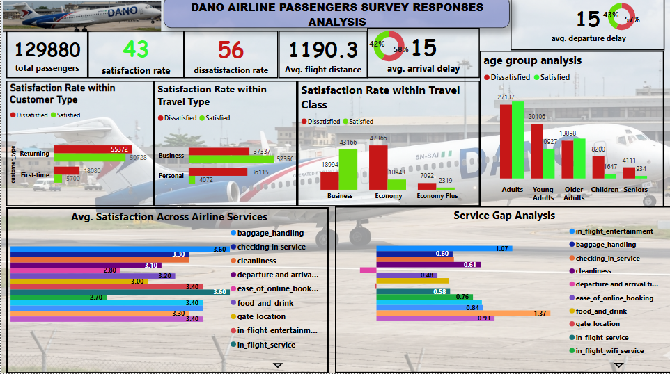

# Dano-Airline-Passenger-Satisfaction-Analysis
Dano Airline Passenger Satisfaction Analysis: Evaluating Service Quality, Satisfaction Drivers and Customer Experience

## INTRODUCTION :

The aviation industry is highly competitive, making customer satisfaction a critical factor for airline success.  Passengers today expect reliable services, comfortable travel experiences, timely departures and arrivals and quality in-flight services. Understanding passenger perceptions helps airlines identify service gaps, improve customer experience and increase customer loyalty.

This project analyzes passenger satisfaction data from Dano Airlines, a UK based airline in London. The analysis was to evaluate customer experiences across different customer segments, travel classes and service attributes. 

Tools used to carry out this analysis were PostgreSQL for data cleaning and transformation and PowerBI for visualization and dashboard development.

### Project Objectives:

The project objectives of this analysis are to:
1. Measure the overall passenger satisfaction level.
2. Identify the proportion of satisfied and dissatisfied passengers.
3. Examine satisfaction levels across customer types
4. Analyze satisfaction across travel types and travel classes
5. Evaluate satisfaction among different age groups.
6. Assess the performance of key airline services such as;
- In_flight entertainment
- Baggage handling
- check_in_service
- cleanliness   
- Online Booking
- Food and Drink
- Departure and Arrival Convenience
- Gate Location     e.t.c
7. Identify service gaps contributing to customer dissatisfaction.
8. Provide recommendations to improve customer satisfaction and operation performance.
  
### Importance of the Project

This analysis is important because it enables Dano Airline to:
1. Understand customer perceptions and expectations.
2. Improve customer retention and loyalty.
3. Enhance service quality. 
4. make data driven decisions for customer experience management.

## PROBLEM STATEMENT

Customer satisfaction is a key performance indicator in the airline industry. Dano Airline has experienced a significant decline in customer satisfaction, with the overall satisfaction rate falling below 50%  for the first time in the company's history. 

Therefore, Dano Airline requires a comprehensive analysis of passenger survey data to identify the key drivers of satisfaction and dissatisfaction across different customer segments, travel purposes, age groups and travel classes. 

The insight generated from this analysis will support the development of a data driven strategy aimed at improving service quality, enhancing passenger experience and increasing the overall satisfaction rate above the current level.

### Key Business Questions

This analysis seeks to answer the following questions

1.  What are the current levels of passenger satisfaction and dissatisfaction?
2. Which customer segments are contributing most to the decline in satisfaction?
3. How does satisfaction vary across travel classes and travel purposes?
4. Which age group reports the highest levels of dissatisfaction?
5. Which service attributes have the strongest impact on passenger satisfaction?
6. Where are the largest service quality gaps that require attention.
7. What strategic actions should Dano Airlines prioritize to improve customer satisfaction and regain customer confidence?
